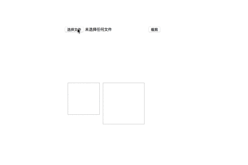

# 图片上传,canvas裁剪

1. 自定义画布大小
2. 自动适应图片大小
3. 支持圆形裁剪和方形裁剪
4. 支持图片拖拽和放大
5. 通过钩子可实现更加强大的功能

⚠️ 仅支持ES6+,仅仅是个玩具!!!

## demo


```html
<input type="file" id="fileInput">
<input type="button" value="裁剪" id="btn">
<div id="container"></div>


```

```js
import imgClip from './imgClip'

let imgClipObj
let fileInput = document.querySelector('#fileInput')

fileInput.addEventListener('change', () => {
  imgClipObj = new imgClip({
    // 容器
    container: document.querySelector('#container'),
    // 画布大小,单位px
    width: 200,
    height: 120,
    // 裁剪区域大小,单位px
    cWidth: 60,
    cHeight: 60,
    // 上传的文件
    file: fileInput.files[0],
    // 裁剪的形状 默认为'circle'圆形, 可配置'rect'为方形
    clipShape: 'circle',
    // 最大放大尺寸, 默认为 2
    maxScale: 3,
    // 当前放大尺寸, 默认为 1
    curScale: 2,
    // 随访条的宽度,单位为px
    sliderWidth: 200,
    // 缩放条的位置,相对于container绝对定位,单位为px
    sliderTop: 120,
    sliderLeft: 0,
    // 每次绘画完的回调, imgData为当前裁剪区域的url,实现图片联动等功能,一般不需要
    canvasDidDraw: (imgData) => {
      document.querySelector('#img1').src = imgData
    }
  })
})

let btn = document.querySelector('#btn')
btn.addEventListener('click', () => {
  document.querySelector('#img2').src = imgClipObj.getImgData()
})
```
